# 🛡️ AI-Powered Fraud Detection System
### 🏆 HSBC Hackathon 2025


## 📌 Executive Summary
**Most fraud models fail because they optimize for accuracy instead of operational stability.**

This project, developed for **HSBC Hackathon 2025**, implements a **"Traffic Light" Risk Engine**. Instead of a simple binary classifier (which often blocks legitimate users), this system fuses **Unsupervised Deep Learning** (Autoencoders) with **Supervised Machine Learning** (XGBoost) to create a three-tier decision matrix.

The result is a system that achieves a **"Zero-Friction" customer experience** (92% Auto-Approval) while capturing sophisticated fraud patterns like Velocity Attacks and Whale Transactions.

---

## 🧠 The Approach: "Deep-Hybrid" Architecture

The core challenge in fraud detection is the **Class Imbalance Problem** (fraud is <1% of data). Standard models often ignore the minority class. To solve this, I designed a unique **Three-Layer Architecture**:

### Layer 1: The "Pattern Engine" (Supervised Learning)
* **Technology:** **XGBoost Classifier** with **SMOTE** (Synthetic Minority Over-sampling).
* **Goal:** Catch **Known Fraud**.
* **How it works:** It analyzes labeled historical data to identify specific signatures, such as high-velocity transactions or mismatched merchant categories. SMOTE ensures the model doesn't overlook rare fraud cases.

### Layer 2: The "Anomaly Engine" (Unsupervised Learning)
* **Technology:** **Deep Autoencoder** (Neural Network / MLPRegressor).
* **Goal:** Catch **Unknown/New Fraud**.
* **How it works:** This model is trained *only* on normal transactions. It learns to compress and reconstruct "normal" behavior. When a novel attack occurs (one the system has never seen), the reconstruction fails, triggering a high "Anomaly Score."

### Layer 3: The "Traffic Light" Logic (Operational AI)
* **Technology:** **Quantile Normalization** & **Hybrid Fusion**.
* **Goal:** Ensure **Operational Stability**.
* **How it works:** Raw probabilities are dangerous in banking because they fluctuate. I normalized the risk scores into percentiles to force a stable output distribution:
    * 🔴 **BLOCK (Top 2%):** High-confidence threats are stopped instantly.
    * 🟡 **REVIEW (Next 5%):** Ambiguous cases are routed to human analysts.
    * 🟢 **APPROVE (Bottom 93%):** Legitimate customers experience zero friction.

---

## 📐 System Architecture Diagram

```mermaid
graph TD
    subgraph Data_Pipeline [Data Pipeline]
    A[Raw Transaction Data] --> B{Feature Engineering}
    B -->|Calculate| C["Velocity (Seconds Diff)"]
    B -->|Calculate| D["Z-Scores (Spending Spikes)"]
    end

    subgraph The_AI_Core [The AI Core]
    C & D --> E[Deep Autoencoder]
    C & D --> F[XGBoost Classifier]
    
    E -->|Anomaly Score| G[Hybrid Fusion Layer]
    F -->|Fraud Probability| G
    end
    
    subgraph Decision_Engine [Decision Engine]
    G --> H{Traffic Light Logic}
    H -->|Top 2% Risk| I[🔴 BLOCK]
    H -->|Next 5% Risk| J[🟡 REVIEW]
    H -->|Bottom 93%| K[🟢 APPROVE]
    end

```



---

## 🛠️ Key Technical Features

| Feature | Description | Business Value |
| --- | --- | --- |
| **Velocity Tracking** | Calculates time-deltas between transactions. | Detects **Bot Attacks** (100 txns/minute). |
| **Z-Score Analysis** | Measures deviation from a user's personal average. | Detects **Account Takeover** (Sudden high spending). |
| **SMOTE** | Generates synthetic fraud examples during training. | Solves the **"Needle in a Haystack"** imbalance. |
| **Quantile Binning** | Uses percentile ranks instead of fixed thresholds. | Prevents the model from blocking everyone during data drifts. |

---

## 🚀 How to Run the Project

### 1. Prerequisites

Ensure you have Python installed. Install the required dependencies:

```bash
pip install pandas numpy xgboost scikit-learn imbalanced-learn

```

### 2. File Structure

* `fraud_detection_system.py`: The main pipeline (Training + Inference).
* `fraud_dataset.csv`: Historical training data.
* `test.csv`: New transactions to evaluate.

### 3. Execution

Run the script to train the Hybrid Engine and generate predictions:

```bash
python fraud_detection_system.py

```

### 4. Output

The system generates `submission_final.csv` with the following columns:

* `transaction_id`: Unique ID.
* `risk_score`: 0 to 1 scale (Higher = Risky).
* `action`: **APPROVE**, **REVIEW**, or **BLOCK**.

---

## 📊 Results (Stress-Test)

Tested on a dataset containing deliberate attacks (Whale Transactions, Midnight Snipers):

* **Operational Efficiency:** **92%** of customers approved automatically.
* **Analyst Workload:** Only **6%** of transactions sent for review.
* **Fraud Capture:** Successfully blocked the "Whale Attack" ($9,999 transaction) and "Velocity Attack" (3 txns in 1 minute).

---

## 🔮 Future Improvements

* **Graph Neural Networks (GNN):** To detect fraud rings by linking shared device IDs or IP addresses.
* **Real-Time Streaming:** Deploying the inference engine on Apache Kafka for sub-millisecond latency.
* **Explainable AI (SHAP):** Providing exact "Reason Codes" (e.g., "Blocked because location mismatch") to the analyst dashboard.

---

*Created for HSBC Hackathon 2025.*
